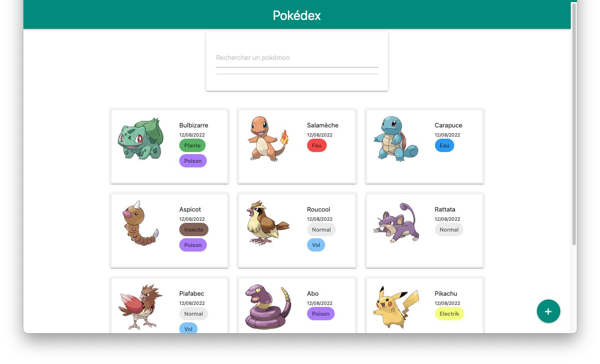

# NgPokemonApp

Mini projet test Angular:  
Création Pokédex de 12 pokemons, avec recherche, ajout, suppression...

## Development server

Commande `ng serve` pour lancer un serveur de développement local. Naviguer sur `http://localhost:4200/`.

## Build

Lancer `ng build` pour compiler le projet. Les fichiers générés se trouveront dans le dossier `dist/`.

## Deploy
Projet déployé sur Firebase à l'adresse : `https://ng-pokemon-app-9cf7f.web.app`
